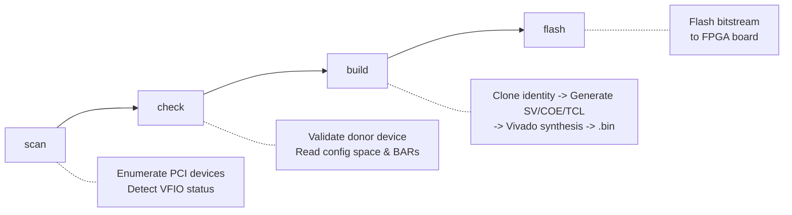

> [!CAUTION]
> This tool is provided for **educational and research purposes only**. The authors do not condone or encourage the use of this software for cheating, circumventing anti-cheat systems, or any other activity that violates terms of service of any software or platform. Users are solely responsible for ensuring their use of this tool complies with all applicable laws and agreements.

<p align="center">
  
</p>

<h1 align="center">PCILeechGen</h1>

<p align="center">
  <strong>Custom firmware generator for <a href="https://github.com/ufrisk/pcileech-fpga">PCILeech FPGA</a> boards</strong><br>
  Reads a real PCI/PCIe donor device via VFIO, clones its complete identity including config space, BARs, and capabilities, and builds a ready-to-flash <code>.bin</code> firmware through Vivado.
</p>

<p align="center">
  <a href="https://github.com/sercanarga/PCILeechGen/actions/workflows/codeql.yml"></a>
  <a href="https://github.com/sercanarga/PCILeechGen/actions/workflows/ci.yml"></a>
  <a href="https://goreportcard.com/report/github.com/sercanarga/pcileechgen"></a>
  <a href="https://go.dev/"></a>
  <a href="https://github.com/sercanarga/PCILeechGen/blob/main/LICENSE"></a>
  <a href="https://discord.gg/kcWVCAhNSg"></a>
</p>


## Contents

- [Features](#features)
- [How It Works](#how-it-works)
- [Supported Boards](#supported-boards)
- [Quick Start](#quick-start)
- [Commands](#commands)
- [Utilities](#utilities)
- [Output](#output)
- [Architecture](#architecture)
- [Development](#development)
- [Special Thanks](#special-thanks)
- [License](#license)


## Features

<table>
<tr><td valign="top">

**Device Identity Cloning**
- Vendor / Device / Revision ID
- Subsystem Vendor / Device ID
- Class Code (base, sub-class, interface)
- Device Serial Number (stripped when absent from donor)

</td><td valign="top">

**BAR Emulation**
- BAR0 Layout (type, size, 32/64-bit)
- BAR Content Emulation (donor memory snapshot)
- NVMe CC->CSTS State Machine
- NVMe Admin Queue Responder (Identify, Set/Get Features, Create IO CQ/SQ)
- NVMe DMA Bridge (admin queue doorbell + completion)
- xHCI USBCMD/USBSTS State Machine
- Auto-bind VFIO on BAR read failure
- Unreliable probe data detection (0xFF rejection)
- BAR size power-of-2 rounding
- Build-time offset validation

</td></tr>
<tr><td valign="top">

**Config Space**
- Full 4KB shadow + scrubbing pipeline (17 passes)
- Per-register write masks (PM/PCIe lock, SlotCtl, DevCtl2, LinkCtl2, upper 32-bit BAR)
- PCIe Capability Injection (synthesized PCIe v2 Endpoint for conventional PCI donors)
- Power Management lock (D-state + NoSoftReset, PMCSR write-protected)
- Vendor Quirks (Renesas firmware status)
- Vendor-Specific Capability Preservation (Intel, Realtek, Broadcom, Qualcomm, ASMedia)

</td><td valign="top">

**Capability Management**
- Capability Filtering (SR-IOV, Resizable BAR, ATS, L1PM, etc.)
- Capability Pruning (VPD, AGP, HyperTransport, PCI-X)
- MSI Vector Count Matching (donor Multiple Message Capable)
- MSI-X Capability Mirroring (table size, BIR, offsets from donor)
- MSI-X Table Replication (separate BRAM, donor table + PBA)
- MSI-X Interrupt Controller (4-state FSM with LFSR jitter)

</td></tr>
<tr><td valign="top">

**Stealth & Timing**
- TLP Latency Emulation (xorshift128+ PRNG, 4-seed, thermal drift, burst correlation)
- Donor-Profiled TLP Timing (per-device response histogram CDF reproduction)
- Write Completion Emulation (separate MMIO write latency FSM with wr_ack handshake)
- Completion Timeout (force-release hung reads with 0xFFFFFFFF after configurable cycles)
- ASPM Clamping (L0s/L1, Clock PM, and LTR Mechanism disable)
- AER Mask Normalization (error reporting stealth)
- Power State Variance (PMC Data Scale jitter per build)
- Subsystem ID Offset Jitter (±1 random offset, stays within driver tolerance)
- DSN OUI-Preserving Randomization (valid DSNs keep vendor OUI, serial randomized per build)
- Link Speed / Width (clamped to board maximum, not donor negotiated speed)
- P&R Randomization (per-build Vivado placement seed)
- VSEC Entropy Embed (build-unique fingerprint via VSEC ID=0xFC in extended config space)

</td><td valign="top">

**Diagnostics & Validation**
- VFIO Diagnostics (power state, BAR accessibility, IOMMU isolation)
- Fallback Config (class-based defaults for NVMe, xHCI, Ethernet, Audio, GPU, SATA, Wi-Fi, Thunderbolt, Generic)
- Post-Build Validation (output file existence, SV IDs, HEX/COE format)
- Vivado Build Report (error categorization, benign warning filter)
- Build Manifest (JSON with SHA256 checksums)
- Manifest Verification (`verify-manifest` - integrity check)
- Config Space Diff Report (per-byte change log with reasons)
- Capability Chain Validation (pointer sanity, loop detection, max depth check)

</td></tr>
</table>

> [!TIP]
> Run `check` before `build` to verify donor device suitability and board compatibility.


## How It Works



---

## Supported Boards

| Board | FPGA | Lanes | Form Factor |
|:------|:-----|:-----:|:-----------:|
| [CaptainDMA_M2_x1](https://github.com/ufrisk/pcileech-fpga/tree/master/CaptainDMA) | XC7A35T-325 | x1 | M.2 |
| [CaptainDMA_M2_x4](https://github.com/ufrisk/pcileech-fpga/tree/master/CaptainDMA) | XC7A35T-325 | x4 | M.2 |
| [CaptainDMA_35T](https://github.com/ufrisk/pcileech-fpga/tree/master/CaptainDMA) | XC7A35T-484 | x1 | PCIe |
| [CaptainDMA_75T](https://github.com/ufrisk/pcileech-fpga/tree/master/CaptainDMA) | XC7A75T-484 | x1 | PCIe |
| [CaptainDMA_100T](https://github.com/ufrisk/pcileech-fpga/tree/master/CaptainDMA) | XC7A100T-484 | x1 | PCIe |
| [ScreamerM2](https://github.com/ufrisk/pcileech-fpga/tree/master/ScreamerM2) | XC7A35T-325 | x1 | M.2 |
| [pciescreamer](https://github.com/ufrisk/pcileech-fpga/tree/master/pciescreamer) | XC7A35T-484 | x1 | PCIe |
| [NeTV2_35T](https://github.com/ufrisk/pcileech-fpga/tree/master/NeTV2) | XC7A35T-484 | x1 | M.2 |
| [NeTV2_100T](https://github.com/ufrisk/pcileech-fpga/tree/master/NeTV2) | XC7A100T-484 | x1 | M.2 |
| [PCIeSquirrel](https://github.com/ufrisk/pcileech-fpga/tree/master/PCIeSquirrel) | XC7A35T-484 | x1 | PCIe |
| [EnigmaX1](https://github.com/ufrisk/pcileech-fpga/tree/master/EnigmaX1) | XC7A75T-484 | x1 | M.2 |
| [ZDMA](https://github.com/ufrisk/pcileech-fpga/tree/master/ZDMA) | XC7A100T-484 | x4 | PCIe |
| [GBOX](https://github.com/ufrisk/pcileech-fpga/tree/master/GBOX) | XC7A35T-484 | x1 | Mini PCIe |
| [ac701_ft601](https://github.com/ufrisk/pcileech-fpga/tree/master/ac701_ft601) | XC7A200T-676 | x4 | Dev Board |
| [acorn](https://github.com/ufrisk/pcileech-fpga/tree/master/acorn_ft2232h) | XC7A200T-484 | x4 | M.2 |
| [litefury](https://github.com/ufrisk/pcileech-fpga/tree/master/ZDMA) | XC7A100T-484 | x4 | M.2 |
| [sp605_ft601](https://github.com/ufrisk/pcileech-fpga/tree/master/sp605_ft601) | XC6SLX45T-484 | x1 | Dev Board |

---

## Quick Start

### Prerequisites

- **Go** 1.26+
- **Linux** with IOMMU/VFIO enabled
- **Vivado** 2023.2+ (for synthesis)

> [!NOTE]
> VFIO requires IOMMU to be enabled in BIOS and kernel parameters (`intel_iommu=on` or `amd_iommu=on`).

### Installation

```bash
git clone --recurse-submodules https://github.com/sercanarga/PCILeechGen.git
cd PCILeechGen && make build
```

> [!IMPORTANT]
> The `--recurse-submodules` flag is required to fetch the pcileech-fpga library.

### Usage

```bash
# 1. Scan for available PCI devices
sudo ./bin/pcileechgen scan

# 2. Check if a device is suitable as donor
sudo ./bin/pcileechgen check --bdf 0000:02:00.0

# 3. Build firmware
sudo ./bin/pcileechgen build --bdf 0000:03:00.0 --board CaptainDMA_100T
```

---

## Commands

### `scan` - List PCI Devices

Shows all PCI devices with VFIO compatibility status.

```bash
sudo ./bin/pcileechgen scan
```

<details>
<summary>Example output</summary>

```
0000:00:00.0 Host bridge [0600]: Intel Corporation Xeon E3-1200 v6/7th Gen Core Processor Host Bridge [8086:591f]
0000:00:17.0 SATA controller [0106]: Intel Corporation 200 Series PCH SATA controller [8086:a282]
0000:01:00.0 VGA compatible controller [0300]: NVIDIA Corporation GP106 [GeForce GTX 1060 3GB] [10de:1c02] [WARN] group(3)
0000:02:00.0 Audio device [0403]: Creative Labs CA0132 Sound Core3D [1102:0012] [OK] vfio

Total: 16 devices
```

</details>

### `check` - Verify Donor Device

Runs a full diagnostic on a device to verify donor suitability.

```bash
sudo ./bin/pcileechgen check --bdf 0000:02:00.0
```

<details>
<summary>Example output</summary>

```
Checking device 0000:02:00.0...

[OK] Device found: 1102:0012 Audio device
[OK] Config space readable: 4096 bytes
[OK] IOMMU is enabled
[OK] VFIO modules loaded
[OK] IOMMU group: 9
[OK] Device is alone in its IOMMU group
[OK] Power state: D0 (active)
[OK] Already bound to vfio-pci

Capabilities (3):
  [01] Power Management at offset 0x50
  [05] MSI at offset 0x60
  [10] PCI Express at offset 0x70

Extended Capabilities (4):
  [0001] Advanced Error Reporting at offset 0x100
  [0003] Device Serial Number at offset 0x150
  [0010] Single Root I/O Virtualization at offset 0x180
  [0002] VC at offset 0x260

BARs:
  BAR0: Memory32 at 0xfe800000, size 16 KiB [accessible]

--- Board Compatibility ---
Donor Link: 2.5 GT/s x1
Donor DSN:  0x0123456789abcdef

Compatible boards:
  PCIeSquirrel           xc7a35tfgg484-2 x1 (exact match)
  CaptainDMA_100T        xc7a100tfgg484-2 x1 (exact match)
  ...

Total: 17 boards

--- Summary ---
[OK] Device is ready for firmware generation
```

</details>

### `build` - Generate Firmware

Generates firmware artifacts and optionally runs Vivado synthesis.

```bash
# Full build (artifacts + Vivado synthesis)
sudo ./bin/pcileechgen build --bdf 0000:03:00.0 --board CaptainDMA_100T

# Artifacts only (no Vivado)
sudo ./bin/pcileechgen build --bdf 0000:03:00.0 --board CaptainDMA_100T --skip-vivado

# Offline build from saved JSON
sudo ./bin/pcileechgen build --from-json device_context.json --board CaptainDMA_100T --skip-vivado
```

> [!WARNING]
> Full synthesis may take 30-60 minutes depending on FPGA size. Use `--skip-vivado` to generate only artifacts.

<details>
<summary>All flags</summary>

| Flag | Default | Description |
|:-----|:--------|:------------|
| `--bdf` | - | Donor device BDF address |
| `--board` | - | Target FPGA board **(required)** |
| `--from-json` | - | Load donor data from JSON (offline build) |
| `--output` | `pcileech_datastore` | Output directory |
| `--lib-dir` | `lib/pcileech-fpga` | Path to pcileech-fpga library |
| `--skip-vivado` | `false` | Only generate artifacts, skip synthesis |
| `--stock-bar` | `false` | Skip custom BAR module generation (uses stock pcileech-fpga BAR controller) diagnostic flag for isolating detection issues |
| `--vivado-path` | auto-detect | Path to Vivado installation |
| `--jobs` | `4` | Parallel Vivado jobs |
| `--timeout` | `3600` | Vivado timeout (seconds) |

</details>

### `validate` - Verify Artifacts

Verifies generated artifacts match the donor device context.

```bash
./bin/pcileechgen validate --json device_context.json --output-dir pcileech_datastore/
./bin/pcileechgen validate --json device_context.json --board PCIeSquirrel  # exact build match
```

> Checks include: output file existence, vendor/device ID presence in SV, HEX line format, COE structure.

### `verify-manifest` - Verify Build Integrity

Checks that all build artifacts match their SHA256 checksums in the manifest.

```bash
./bin/pcileechgen verify-manifest --manifest pcileech_datastore/build_manifest.json --output-dir pcileech_datastore/
```

### `version` - Print Version

```bash
./bin/pcileechgen version
```

### `boards` - List Supported Boards

```bash
./bin/pcileechgen boards
```

<details>
<summary>Example output</summary>

```
NAME              FPGA PART          PCIe  TOP MODULE
----              ---------          ----  ----------
PCIeSquirrel      xc7a35tfgg484-2    x1    pcileech_squirrel_top
ScreamerM2        xc7a35tcsg325-2    x1    pcileech_screamer_m2_top
CaptainDMA_100T   xc7a100tfgg484-2   x1    pcileech_100t484_x1_top
ZDMA              xc7a100tfgg484-2   x4    pcileech_tbx4_100t_top
...

Total: 17 boards
```

</details>

---

## Utilities

### Windows Device History Cleanup

After flashing and testing firmware, Windows caches device metadata in the registry. Stale entries from previous firmware builds can cause conflicts, Code 10 errors, or driver misidentification. The `tools/` directory contains an interactive cleanup utility:

| File | Description |
|:-----|:-----------|
| `cleanup_device_history.bat` | Windows batch launcher (double-click, runs as Administrator) |
| `cleanup_device_history.ps1` | PowerShell script with interactive arrow-key menu |

**Usage:**
- **Double-click** `cleanup_device_history.bat` and confirm UAC prompt
- Or open PowerShell as Administrator and run: `.\cleanup_device_history.ps1`

> [!TIP]
> If running the `.ps1` directly and you get an execution policy error, use: `powershell -ExecutionPolicy Bypass -File .\cleanup_device_history.ps1`

**Features:**
- Scans both PCI (`Enum\PCI`) and USB (`Enum\USB`) device history across all ControlSets
- Deduplicates by Hardware ID + Instance ID, merging multi-ControlSet entries
- Interactive menu with arrow key navigation, driver info, and device type tags `[PCI]`/`[USB]`
- Automatic registry backup to desktop before any changes
- Cleans setupapi logs, DeviceMetadataStore, PnP event logs, and device migration cache

> [!IMPORTANT]
> Requires Administrator privileges. Reboot after cleanup before reconnecting the device.

---

## Output

The build command generates the following directory structure:

```
pcileech_datastore/
├── device_context.json                  # Donor device snapshot
├── pcileech_cfgspace.coe                # 4KB config space (scrubbed)
├── pcileech_cfgspace_writemask.coe      # Per-register write masks
├── pcileech_bar_zero4k.coe             # BAR0 content snapshot
├── pcileech_bar_impl_device.sv         # BAR implementation (register-level)
├── pcileech_tlps128_bar_controller.sv  # TLP BAR controller
├── pcileech_msix_table.sv              # MSI-X table + PBA emulation
├── pcileech_nvme_admin_responder.sv    # NVMe admin queue FSM (if NVMe)
├── pcileech_nvme_dma_bridge.sv        # NVMe DMA bridge (if NVMe)
├── tlp_latency_emulator.sv            # Response latency emulation
├── device_config.sv                    # Device identity + feature flags
├── config_space_init.hex               # Config space init ($readmemh)
├── msix_table_init.hex                 # MSI-X table init ($readmemh)
├── identify_init.hex                   # NVMe Identify ROM (if NVMe)
├── scrub_diff_report.txt               # Config space change log (per-byte)
├── build_manifest.json                 # File checksums + build metadata
├── vivado_generate_project.tcl         # Project creation script
├── vivado_build.tcl                    # Synthesis script
├── src/                                # Patched board SV sources
└── *.bin                               # Bitstream (after Vivado)
```

---

## Architecture

```
cmd/pcileechgen/              CLI entry point
│                             scan, check, build, validate, verify-manifest, boards, version
│
internal/
├── board/                    Board registry (embedded JSON, 17 boards)
├── donor/                    VFIO device reader + BAR profiling
├── pci/                      Config space parser, capabilities, MSI-X
├── firmware/
│   ├── scrub/                Config space scrubbing (17-pass pipeline)
│   ├── barmodel/             BAR register model (spec + profiled)
│   ├── svgen/                SV code generation (embedded .sv.tmpl templates)
│   ├── nvme/                 NVMe Identify data generation
│   ├── tclgen/               Vivado TCL script generation
│   ├── devclass/             Device class strategy (NVMe, xHCI, Ethernet, Audio, GPU, SATA, Wi-Fi, Thunderbolt)
│   ├── fallback/             Class-based fallback config (when probe data is unavailable)
│   ├── output/               Artifact writer (SV pipeline + COE + HEX)
│   ├── overlay/              Byte-level diff tracking
│   ├── variance/             Config space randomization
│   └── codegen/              HEX/COE formatters
└── vivado/                   Vivado process runner
```

## Development

```bash
make test             # Run all tests
make test-coverage    # Run tests with coverage report
make lint             # Run linter
make check            # Run vet + lint + test (all checks)
```

## Special Thanks

- **[pcileech-fpga](https://github.com/ufrisk/pcileech-fpga)** by Ulf Frisk - the FPGA framework this project builds upon
- **[CaptainDMA](https://captaindma.com)** - for best FPGA DMA hardware

## License

[Creative Commons Zero v1.0 Universal](https://github.com/sercanarga/PCILeechGen/blob/main/LICENSE)